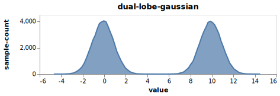
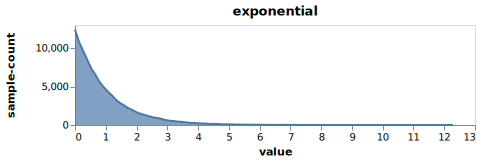

# Streams


Simple programmatic model for infinite streams of numbers or objects primitive
and doing arithmetic operations (in double space) on them.  Provides basic structure for
monte-carlo simulations.

Streams are an interesting concept as they are lazy noncaching and also not indexable.  If we
combine lazy-noncaching with infinite or unlimited streams we get an extremely efficient
compositional model as we don't need iterators in the composition -- there is no need to
check `hasNext`.  We can simply get the next item - throughout this library the things returned
implement this efficiently in the unlimited case in the 0-arg IFn implementation so you can
just call them with no arguments.

When we stick to unlimited streams we get as efficient a compositional model as dtype-next's with
a simpler definition and composition rules and *without* needing to type the data.  Both
dtype-next's compositional model and this library's compositional model are far faster
as the compositions get more complex than either clojure's default lazy caching sequences or
the transducer model which is lazy caching but limited.

Exmaples use fastmath/random for distributions and the transducers in kixi.stats.core for
basic stats.


* [API Docs](https://cnuernber.github.io/streams/)


```clojure
user> (-> (streams/interleave (streams/gaussian-stream)
                              (streams/+ (streams/gaussian-stream) 10))
          (graphs/stream-area-chart {:title :dual-lobe-gaussian
                                     :width 400 :height 100
                                     :n-bins 100})
          (graphs/spit-chart-svg-to-file "docs/dual-lobe-gaussian.svg"))
nil
```



```clojure
user> (-> (streams/fastmath-stream :exponential)
          (graphs/stream-area-chart {:title :exponential
                              :width 400 :height 100
                              :n-bins 100})
          (graphs/spit-chart-svg-to-file "docs/exponential.svg"))
nil
```



# Usage

Basic nongraphing dependencies:

```clojure
com.cnuernber/streams {:git/url "https://github.com/cnuernber/streams/"
                       :sha "2f2a938f74dd810b77f236803dc8c0b3708541ef"}
```

See graphs namespace api docs for graphing dependencies - and off we go...


```clojure
user> (require '[streams.api :as streams])
nil
user> (streams/gaussian-stream)
#<api$gaussian_stream$reify__12152@55cdf74d: 0.6240818464335962>
user> (def s (streams/gaussian-stream))
#'user/s
user> (s)
-0.16975820365256886
user> (s)
-1.6307662273913865
user> (streams/sample 10 s)
[-0.6404845735349934, -1.0984499305114408, -0.5752360591253568, 0.7952341368967761,
 -0.6264447099025137, -1.3414595772573175, 0.8635277761944913, 0.14471045180223024,
 0.8760897398968388, -1.9421380093798732]
user> (transduce identity kixi/mean (streams/take 10000 s))
0.01787902394250977
user> (require '[ham-fisted.api :as hamf])
nil
user> (hamf/reduce-reducer (hamf/compose-reducers
                            {:mean kixi/mean
                             :variance kixi/variance
                             :min kixi/min
                             :max kixi/max})
                           (streams/take 10000 s))
{:min -3.7266349360253326,
 :variance 0.9692690872594321,
 :max 3.8224405544320126,
 :mean 0.005754586370137619}
user> (->> (streams/+ s 10)
           (streams/take 10000)
           (hamf/reduce-reducer
            (hamf/compose-reducers {:mean kixi/mean
                                    :variance kixi/variance
                                    :min kixi/min
                                    :max kixi/max})))
{:min 6.115105701266868,
 :variance 0.9878880582367155,
 :max 13.446008078878219,
 :mean 9.997547011946645}
user> (require '[fastmath.random :as fast-r])
nil
user> (fast-r/distribution :exponential)
#object[org.apache.commons.math3.distribution.ExponentialDistribution 0x3dd142f6 "org.apache.commons.math3.distribution.ExponentialDistribution@3dd142f6"]
user> (def exp-d (fast-r/distribution :exponential))
#'user/exp-d
user> (require '[fastmath.protocols :as fast-p])
nil
user> (fast-p/sample exp-d)
0.5546137613787906
user> (fast-p/sample exp-d)
1.1145401213453967
user> (fast-p/sample exp-d)
4.848989177173837

user> ;;s is passed into + along with exponential stream
user> (->> (let [dist (fast-r/distribution :exponential)]
             (streams/stream (fast-p/sample dist)))
           (streams/+ s 10)
           (streams/take 10000)
           (hamf/reduce-reducer
             (hamf/compose-reducers {:mean kixi/mean
                                     :variance kixi/variance
                                     :min kixi/min
                                     :max kixi/max})))

{:min 10.017125966655641,
 :variance 1.9930823384144312,
 :max 21.25865140655251,
 :mean 11.986870739237215}
user> (->> (streams/fastmath-stream :exponential)
           (streams/+ s 10)
           (streams/take 10000)
           (hamf/reduce-reducer
             (hamf/compose-reducers {:mean kixi/mean
                                     :variance kixi/variance
                                     :min kixi/min
                                     :max kixi/max})))
{:min 6.659285377918934,
 :variance 1.970266932907259,
 :max 18.57889358544537,
 :mean 10.982617281509123}
```

# Lies, Damn Lies, And Benchmarks!

I benchmarked this library on my m1-mac with the brew-installed jdk-19.  The
benchmark code is [perftest.clj](dev/src/perftest.clj), the script
in [scripts/benchmark](scripts/benchmark) and the results are
checked into [docs](docs/m1-mac-benchmark.data).  Here is a synopsis -
Default clojure pathways are 6x slower roughly than either streams or dtype-next
when there is no composition and -> 23x+ times slower when we perform a complex
(4 arity) summation.

I want to stress that this is an unavoidable result if we commit to lazy caching vs.
lazy noncaching computational models and *not* a result of implementation details in
Clojure's core libraries -- in fact the chunking system introduced into Clojure's compute
model makes the lazy caching pathway significantly more efficient.

Lazy caching is a much more forgiving computational model - but it eliminates several crucial,
important optimization opportunities.  As stated earlier in the readme lazy noncaching sequences
can be as efficient as lazy noncaching random access models if we avoid limiting the streams
and can compute with infinite streams.

#### Basic Reduction

The basic reduction tests creates 10000 uniform doubles in a reduce call.  For the efficient systems,
this is timing how expensive your random number generator is per-call.


| system       |   code                                                         | performance  |
| ---          |  ---                                                           | ---:         |
| clj          | `(repeatedly 10000 sampler)`                                   | 300 µs       |
| stream       | `(streams/stream 10000 (sampler)`                              | 64.241910 µs |
| dtype        | `(dt/make-reader :float64 10000 (sampler))`                    | 59.200689 µs |
| java typed   | `(Reductions/doubleSamplerReduction rfn nil idxsampler 10000)` | 56.765409 µs |
| java untyped |  `(Reductions/samplerReduction rfn nil idxsampler 10000)`      | 56.077244 µs |


#### Summation Reduction

The summation reduction test is meant to test nontrivial composition - sum 4 streams together.


| system | code                                                                                                     | performance   |
| ------ | ---                                                                                                      | -----------:  |
| clj    | `(double-array (take 10000 (map + rs rs rs rs)))`                                                        | 6.530224 ms   |
| stream | `(streams/sample 10000 (streams/+ s s s s))`                                                             | 280.429330 µs |
| dtype  | `(dt/->array (dfn/+ rdr rdr rdr rdr))`                                                                   | 278.655565 µs |
| inline | `(streams/sample 10000 (+ (double (sampler)) (double (sampler)) (double (sampler)) (double (sampler))))` | 229.377059 µs |
